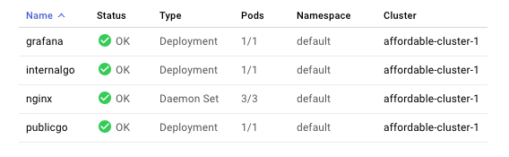

# The affordable GKE Kubernetes cluster

My goal was to set up cheap, fully functional and simple Kubernetes cluster for personal projects. But above all, to learn the ways of Kubernetes. The following setup will create a 3 node Kubernetes cluster that will cost ~5$ per month.

Most of the steps and configuration taken from: https://www.doxsey.net/blog/kubernetes--the-surprisingly-affordable-platform-for-personal-projects.

If for some odd reason someone is reading this, I apologize for the ungenerous explanations. I'd urge you to go ahead and check the blog post, linked above.

-----

## Table of Contents
1. [Create a new project](#section-1)
2. [Create a new cluster](#section-2)
3. [Install `gcloud` and `docker`](#section-3)
4. [Open firewall](#section-4)
5. [Nginx certificates](#section-5)
6. [Build 'n' deploy](#section-6)
7. [Get a domain](#section-7)
8. [Automate updating DNS](#section-8)
9. [Prometheus & Grafana](#section-9)

Starting off with clean GCP account.

> Below I will go over the configuration options that I used to set up my cluster, if someone else is reading this, go wild and adapt it to your needs.

### 1. Create a new project. I called mine the `the-affordable-project`.<a name="section-1"></a>

### 2.  Head over to `Kubernetes Engine` -> `Clusters` and create a new Cluster with following parameters: <a name="section-2"></a>
    * Name: `affordable-cluster-1`
    * Location type: `Zonal`
    * Zone: `europe-west1-b`
    * Master version: at this time, I'm using the latest one, `1.11.2-gke.9`
    * Node pools
        * Number of nodes: `3`
        * Machine type: `f1-micro` (because we're cheap)
        * Boot disk type: `SSD persistent disk`
        * Boot disk size (GB): `10`
        * Enable preemptible nodes (beta): `check` (the nodes will be cheaper)
        * Enable auto-upgrade: `check`
        * Enable auto-repair: `check`
        * Enable autoscaling: `uncheck`
    * Load balancing
        * Enable HTTP load balancing: `uncheck` (gce provided load balancers are too pricey for our affordable cluster)
    * Security
        * Enable basic authentication: `check`
        * Issue a client certificate: `check` 
    * Additional features
        * Enable Stackdriver Logging service: `uncheck` (Stackdriver features are not free)
        * Enable Stackdriver Monitoring service: `uncheck`
        * Enable Kubernetes Dashboard: `uncheck` (Kubernetes Dashboard is deprecated and not really that useful. A better alternative could be Grafana with Prometheus)

Our cluster:


Workloads for a fresh cluster
> This is mostly for myself. Sometimes when running experiments, bloat in the form of unused resources might find it's way in the cluster. Good to know what were the original resources when cluster was first created.


Services for a fresh cluster


Configuration for a fresh cluster


### 3. Install `gcloud` and `docker`. And then follow the steps to configure the clients:<a name="section-3"></a>
```
gcloud auth login
gcloud auth configure-docker
gcloud init
```

If a different project has already been configured previously, might have to fetch the cluster credentials.

`gcloud container clusters get-credentials affordable-cluster-1 --project the-affordable-project`


### 4. Since we're not going to use GCE load balancers, we will need to open our nodes to the public network. Before we can do that, we need a firewall opening. Head to https://console.cloud.google.com/networking/firewalls/list and create a new firewall rule.<a name="section-4"></a>

* Name: `http`
* Targets: `All instances in the network`
* Source IP ranges: `0.0.0.0/0`
* Protocols and ports
    * Specified protocols and ports:
        * tcp: `80, 443`

> When doing the setup the first time, I missed the `Targets` option and left the default one which needs tags to be set. Without thinking, I added some value and afterwards spent a very long time debugging why access to the nodes was not working.


### 5. Generate and upload self signed certs for nginx. Note that it's not safe and should not be used in a production environment. I did it to simplify the setup.<a name="section-5"></a>

Generate certs: `sudo openssl req -x509 -nodes -days 365 -newkey rsa:2048 -keyout self-signed.key -out self-signed.crt`

Upload them to GKE as a secret: `kubectl create secret generic nginx-certs --from-file self-signed.crt --from-file self-signed.key`

The nginx-certs secret should be visible under Configuration.

### 6. Build and deploy app and nginx containers<a name="section-6"></a>

Building docker images:
```
docker build -t gcr.io/the-affordable-project/publicgo:latest -f Dockerfile src/publicgo
docker build -t gcr.io/the-affordable-project/internalgo:latest -f Dockerfile src/internalgo

docker push gcr.io/the-affordable-project/publicgo:latest
docker push gcr.io/the-affordable-project/internalgo:latest
```

Deploy:
```
kubectl apply -f publicgo.yaml
kubectl apply -f internalgo.yaml
kubectl apply -f nginx.yaml
```

Test that it works. Find the external IPs for your nodes: `kubectl get nodes -o yaml | less` look for `ExternalIP`, should contain one entry for each node. Try them out:
`http://<ExternalIP>/go` should yield `Hello from publicgo` and `http://<ExternalIP>/go/pinginternal` should yield `Here's the response from internalgo: Hello from internalgo`. Now see if the self signed certs are correctly set up: `https://<ExternalIP>/go`.


### 7. Get a domain and add `A` records that point to the 3 external ip addresses.<a name="section-7"></a>
If all worked well, now we should have fully functional Kubernetes cluster on GKE.
> Ignore the Grafana entries, that was not part of this setup.




### 8. Automate DNS updates.<a name="section-8"></a>
Preemtibles nodes live up to 24h after which they're destroyed and recreated. When that happens, they're assigned a new externalip. To avoid having to manually update `A` records everyday, there's a way to automate it. There's a great solution for that in the blog post I mentioned in the beginning that assumes using Cloudflare DNS services.


### 9. Set up monitoring and alerting capabilities using Prometheus, Alertmanager, PushGateway and Grafana.<a name="section-9"></a>
Set up Tiller and Helm
https://docs.helm.sh/using_helm/#installing-helm
```
brew install kubernetes-helm
helm init
kubectl create serviceaccount --namespace kube-system tiller
kubectl create clusterrolebinding tiller-cluster-rule --clusterrole=cluster-admin --serviceaccount=kube-system:tiller
kubectl patch deploy --namespace kube-system tiller-deploy -p '{"spec":{"template":{"spec":{"serviceAccount":"tiller"}}}}'
```

Install Prometheus, Alertmanager and PushGateway
helm install --name prometheus --namespace monitoring stable/prometheus

Verify that the setup is working.
Run the following command and open localhost:9090 to boot up the Prometheus ui. 
```
  export POD_NAME=$(kubectl get pods --namespace default -l "app=prometheus,component=server" -o jsonpath="{.items[0].metadata.name}")
  kubectl --namespace default port-forward $POD_NAME 9090
```

Same for Alertmanager on :9093
```
  export POD_NAME=$(kubectl get pods --namespace default -l "app=prometheus,component=alertmanager" -o jsonpath="{.items[0].metadata.name}")
  kubectl --namespace default port-forward $POD_NAME 9093
```

And PushGateway on :9091
```
  export POD_NAME=$(kubectl get pods --namespace default -l "app=prometheus,component=pushgateway" -o jsonpath="{.items[0].metadata.name}")
    kubectl --namespace default port-forward $POD_NAME 9091
```

Install Grafana
helm install --name grafana --namespace monitoring stable/grafana

Get password:
```
kubectl get secret --namespace default grafana -o jsonpath="{.data.admin-password}" | base64 --decode ; echo
```

Open tunnel
```
export POD_NAME=$(kubectl get pods --namespace default -l "app=grafana" -o jsonpath="{.items[0].metadata.name}")
kubectl --namespace default port-forward $POD_NAME 3000
```

Open localhost:3000 and login using `admin` and password you got from secrets.
Next configure Prometheus datasource using internal dns (change the name to however you named your prometheus stack)
```
historical-rottweiler-prometheus-server.default.svc.cluster.local
```

Find a fancy dashboard here https://grafana.com/dashboards?search=Kubernetes and import it to your Grafana instance using the dashboard id.


### Encountered issues
When removing/adding services, they gain new cluster ips. We're using internal dns to resolve the ip address of the cluster (e.g. `publicgo.default.svc.cluster.local` might resolve to `10.3.xxx.xxx`) when routing traffic from nginx. Nginx caches the dns, so when deleting/creating services nginx could start returning 504 Bad Gateway. The quickest solution I found was to recreate the nginx `kubectl delete -f nginx.yaml && kubectl apply -f nginx.yaml`. I don't enjoy doing that, but at least it's quite fast.


### Todo
Add NGINX Ingress controller and configure monitoring
